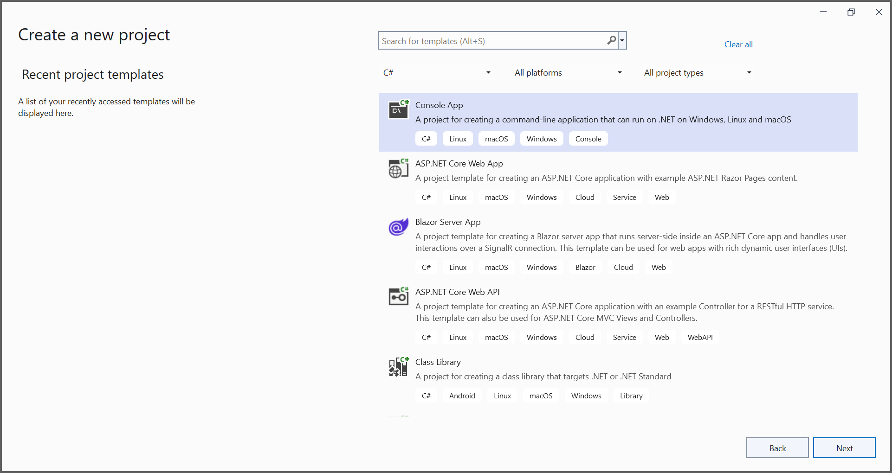
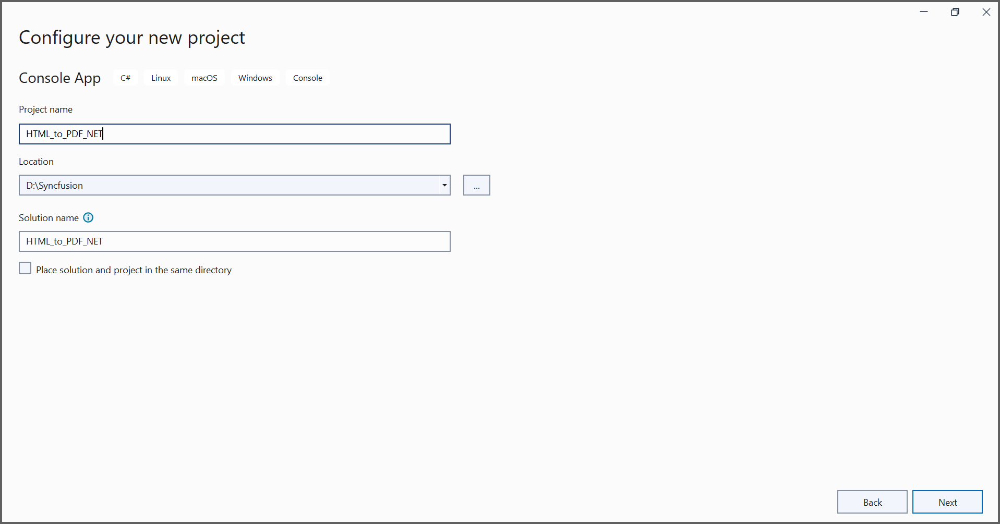
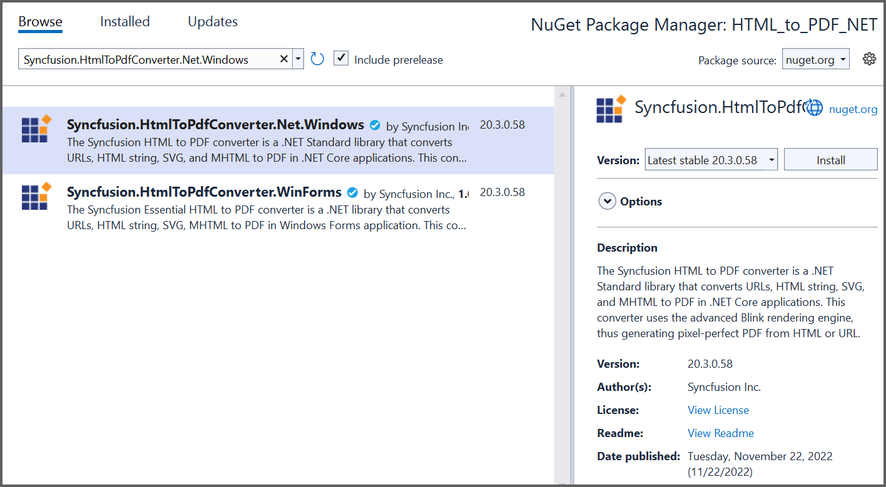

##### Example: .NET

# Convert HTML to PDF file in .NET using C#

The Syncfusion&reg; HTML to PDF converter is a .NET library used to convert HTML or web pages to PDF document in .NET application.

## Steps to convert Html to PDF document in .NET application

1. Create a new .NET console application project.
   
   
   

2. Install [Syncfusion.HtmlToPdfConverter.Net.Windows](https://www.nuget.org/packages/Syncfusion.HtmlToPdfConverter.Net.Windows) NuGet package as a reference to your .NET application from [NuGet.org](https://www.nuget.org/).
   

3. Include the following namespaces in the [Program.cs](HTML-to-PDF-Demo/Program.cs) file.

   ```csharp
   using Syncfusion.HtmlConverter;
   using Syncfusion.Pdf;
   ```

4. Use the following code sample to convert the URL to PDF document in the [Program.cs](HTML-to-PDF-Demo/Program.cs).

   ```csharp
   //Initialize HTML to PDF converter
   HtmlToPdfConverter htmlConverter = new HtmlToPdfConverter();
   BlinkConverterSettings blinkConverterSettings = new BlinkConverterSettings();
   //Set Blink viewport size
   blinkConverterSettings.ViewPortSize = new Syncfusion.Drawing.Size(1280, 0);
   //Assign Blink converter settings to HTML converter
   htmlConverter.ConverterSettings = blinkConverterSettings;
   //Convert URL to PDF document
   PdfDocument document = htmlConverter.Convert("https://www.syncfusion.com");
   //Create a filesteam
   FileStream fileStream = new FileStream("HTML-to-PDF.pdf", FileMode.CreateNew, FileAccess.ReadWrite);
   //Save and close the PDF document
   document.Save(fileStream);
   document.Close(true);
   ```

   By executing the program, you will get the PDF document as follows.
   
