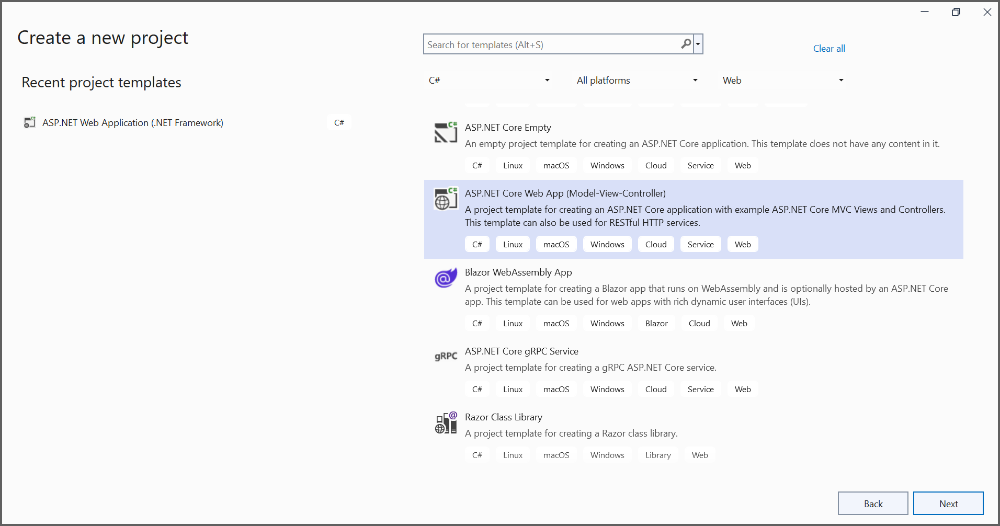
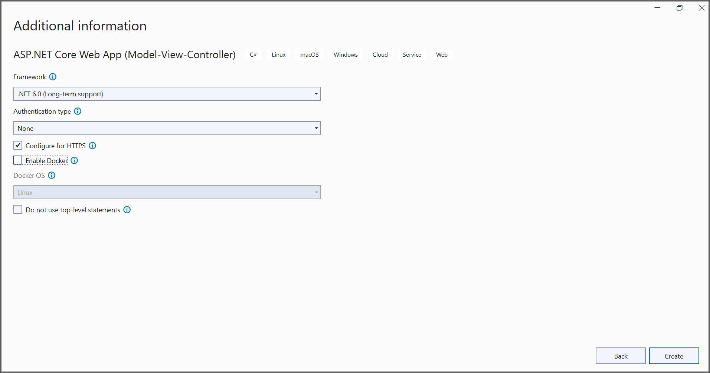
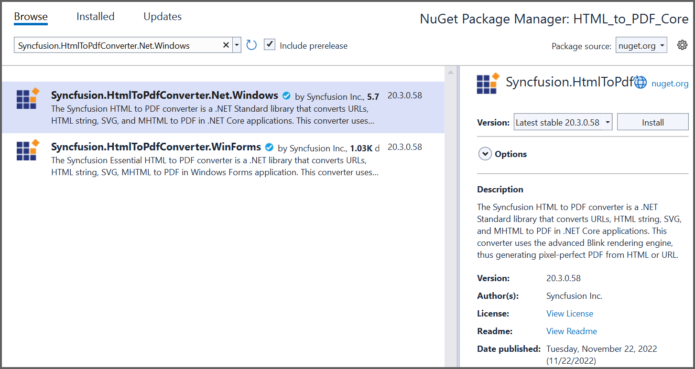

##### Example: ASP.NET Core

# Convert HTML to PDF file in ASP.NET Core using C#

The Syncfusion&reg; HTML to PDF converter is a .NET library used to convert HTML or web pages to PDF document in ASP.NET Core application.  

## Steps to convert HTML to PDF in ASP.NET Core application

1. Create a new C# ASP.NET Core Web Application project.
   

2. In configuration windows, name your project and select Next. 
   
   

4. Install [Syncfusion.HtmlToPdfConverter.Net.Windows](https://www.nuget.org/packages/Syncfusion.HtmlToPdfConverter.Net.Windows) NuGet package as reference to your .NET Standard applications from [NuGet.org](https://www.nuget.org/).
   

5. A default controller with name [HomeController.cs](HTML_to_PDF_Core/Controllers/HomeController.cs) gets added on creation of ASP.NET Core MVC project. Include the following namespaces in that HomeController.cs file.

   ```csharp
   using Syncfusion.Pdf;
   using Syncfusion.HtmlConverter;
   using System.IO;
   ```

6. Add a new button in [index.cshtml](HTML_to_PDF_Core/Views/Home/Index.cshtml) as shown below.

   ```csharp
   @{Html.BeginForm("ExportToPDF", "Home", FormMethod.Post);
       {
          <div>
              <input type="submit" value="Convert PDF" style="width:150px;height:27px" />
          </div>
       }
       Html.EndForm();
   }
   ```

7. Add a new action method named ExportToPDF in [HomeController.cs](HTML_to_PDF_Core/Controllers/HomeController.cs) and include the below code snippet to convert HTML to PDF file and download it.

   ```csharp
   //Initialize HTML to PDF converter.
   HtmlToPdfConverter htmlConverter = new HtmlToPdfConverter();
   BlinkConverterSettings blinkConverterSettings = new BlinkConverterSettings();
   //Set Blink viewport size.
   blinkConverterSettings.ViewPortSize = new Syncfusion.Drawing.Size(1280, 0);
   //Assign Blink converter settings to HTML converter.
   htmlConverter.ConverterSettings = blinkConverterSettings;
   //Convert URL to PDF document.
   PdfDocument document = htmlConverter.Convert("https://www.syncfusion.com");
   //Create memory stream.
   MemoryStream stream = new MemoryStream();
   //Save the document to memory stream.
   document.Save(stream);
   document.Close(); 
   return File(stream.ToArray(), System.Net.Mime.MediaTypeNames.Application.Pdf, "HTML-to-PDF.pdf");
   ```

   By executing the program, you will get the PDF document as follows.
   

