# Convert HTML to PDF file in Azure App Service on Linux using C#

The Syncfusion HTML to PDF converter is a .NET library for converting webpages, SVG, MHTML, and HTML to PDF using C# in Azure App Service on Linux, Azure app service using the Linux [docker](https://www.docker.com/why-docker) container and Azure Function Application Linux. 

## Steps to convert HTML to PDF in Azure App service on Linux

1. Create a new ASP.NET Core MVC application.
    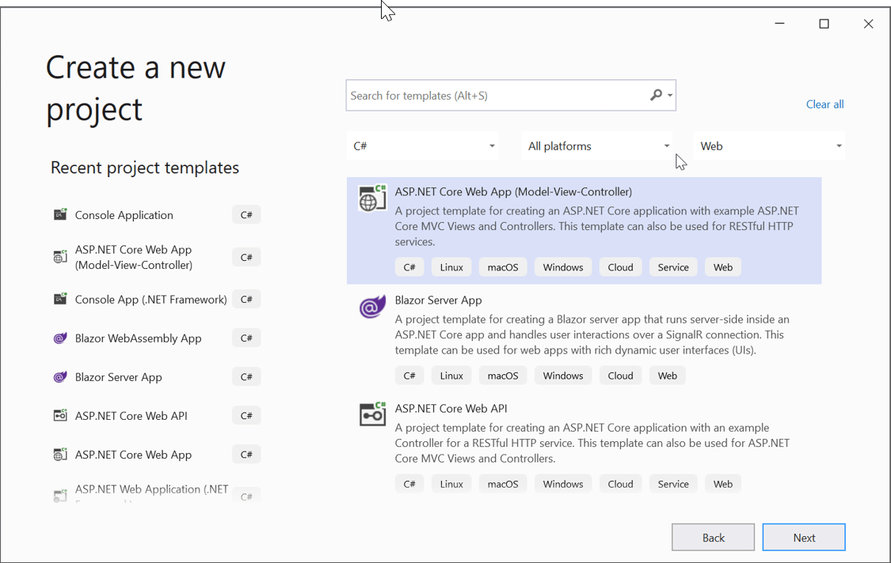

2. Choose your project's target framework and select Configure for HTTPS.
    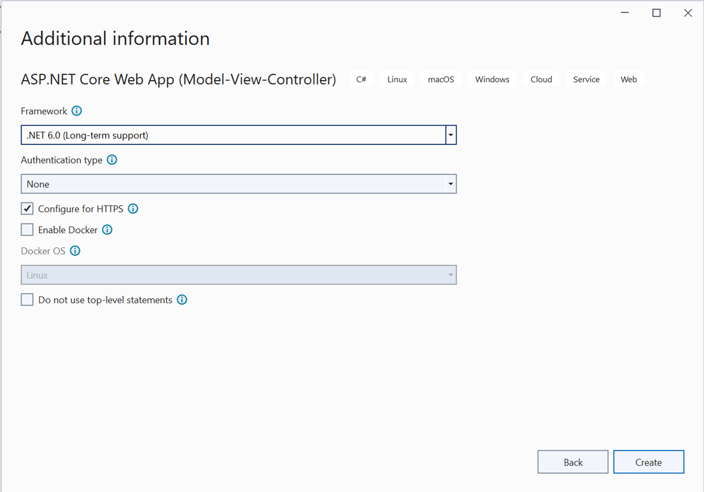

3. Install the [Syncfusion.HtmlToPdfConverter.Net.Linux](https://www.nuget.org/packages/Syncfusion.HtmlToPdfConverter.Net.Linux/) NuGet package as a reference to your .NET Core application [NuGet.org](https://www.nuget.org/).
    !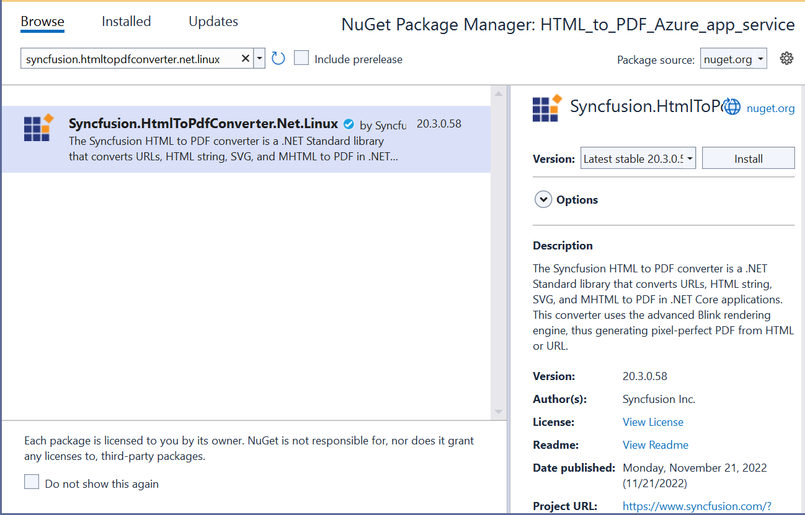

There are two ways to install the dependency packages to Azure server,
1. Using SSH from Azure portal.
2. By running the commands from C#.

### Using SSH command line

1. After publishing the Web application, login to the Azure portal in a web interface and open the published app service. Under Development Tools Menu, Open the SSH and Click the go link.
    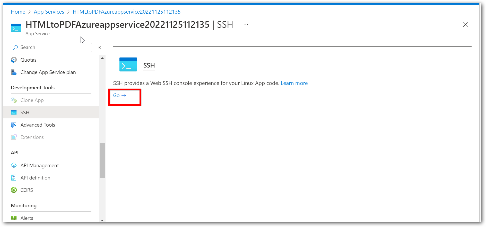

2. From the terminal window, you can install the dependency packages. Use the following single command to install all dependencies packages.

   ```csharp

   apt-get update && apt-get install -yq --no-install-recommends  libasound2 libatk1.0-0 libc6 libcairo2 libcups2 libdbus-1-3 libexpat1 libfontconfig1 libgcc1 libgconf-2-4 libgdk-pixbuf2.0-0 libglib2.0-0 libgtk-3-0 libnspr4 libpango-1.0-0 libpangocairo-1.0-0 libstdc++6 libx11-6 libx11-xcb1 libxcb1 libxcursor1 libxdamage1 libxext6 libxfixes3 libxi6 libxrandr2 libxrender1 libxss1 libxtst6 libnss3 libgbm1

   ```

### Running the commands from C#

1. Create a shell file with the above commands in the project and name it as dependenciesInstall.sh. In this article, these steps have been followed to install dependencies packages. 
    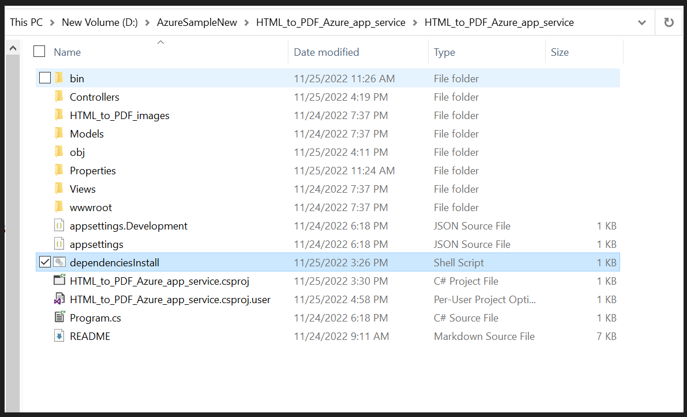

2. Set Copy to Output Directory as "Copy if newer" to the dependenciesInstall.sh file.
    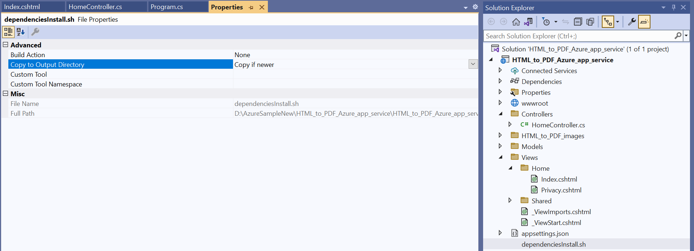

3. Add an Export to the PDF button in the [Index.cshtml](Views\Home\Index.cshtml) file

   ```csharp

   <div class="btn">
    @{ Html.BeginForm("ExportToPDF", "Home", FormMethod.Post);
        {
            <input type="submit" value="Export To PDF" class=" btn" />
        }
   }
   </div>

   ```

4. Include the following namespaces.

   ```csharp

   using Syncfusion.HtmlConverter;
   using Syncfusion.Pdf;
   using System.IO

   ```

5. Add a new action method named ExportToPDF in [HomeController.cs](Controllers/HomeController.cs) and include the below code snippet to convert HTML to PDF file and download it.

   ```csharp

        public ActionResult ExportToPDF()
        {
            Environment.SetEnvironmentVariable("ASPNETCORE_ENVIRONMENT", "Development");
             //Install the dependencies packages for HTML to PDF conversion in Linux
   string shellFilePath = System.IO.Path.Combine(env.ContentRootPath, "dependenciesInstall.sh");
   InstallDependecies(shellFilePath);
            //Initialize HTML to PDF converter 
            HtmlToPdfConverter htmlConverter = new HtmlToPdfConverter();
            BlinkConverterSettings settings = new BlinkConverterSettings();
            //Set command line arguments to run without sandbox.
            settings.CommandLineArguments.Add("--no-sandbox");
            settings.CommandLineArguments.Add("--disable-setuid-sandbox");
            //Assign WebKit settings to the HTML converter 
            htmlConverter.ConverterSettings = settings;
            //Convert HTML string to PDF
            PdfDocument document = htmlConverter.Convert("http://www.syncfusion.com");
            //Save the document into stream
            MemoryStream stream = new MemoryStream();
            document.Save(stream);
            stream.Position = 0;
            //Close the document
            document.Close(true);
            //Defining the ContentType for pdf file
            string contentType = "application/pdf";
            //Define the file name
            string fileName = "URL_to_PDF.pdf";
            //Creates a FileContentResult object by using the file contents, content type, and file name
            return File(stream, contentType, fileName);
        }
         // [C# Code]
    private void InstallDependecies(string shellFilePath)
    {
        Process process = new Process
        {
            StartInfo = new ProcessStartInfo
            {
                FileName = "/bin/bash",
                Arguments = "-c " + shellFilePath,
                CreateNoWindow = true,
                UseShellExecute = false,
            }
        };
        process.Start();
        process.WaitForExit();
    }

   ```

    

## Steps to publish as Azure App Linux

1. Right-click the project and select Publish.
    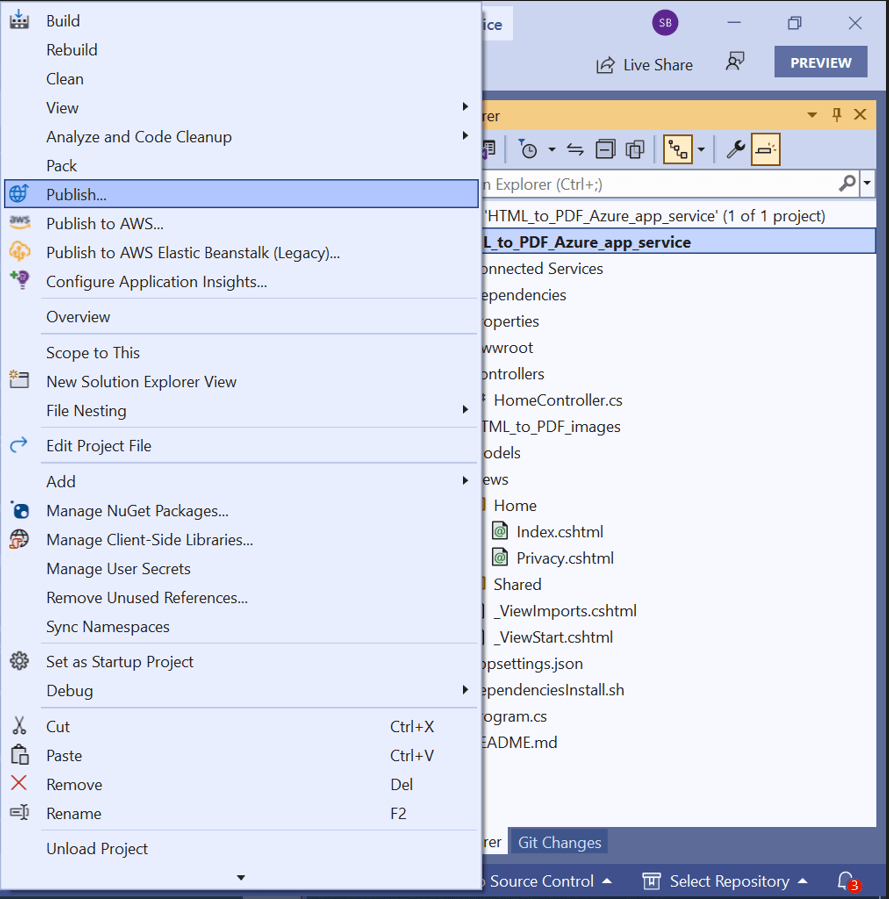

2. Create a new profile in publish target window.
    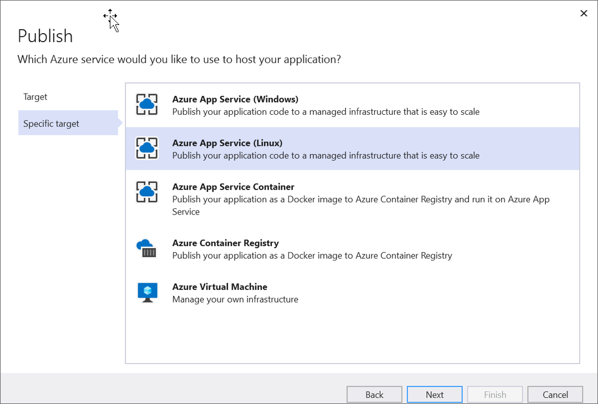

3. Create App service using Azure subscription and select a hosting plan.
    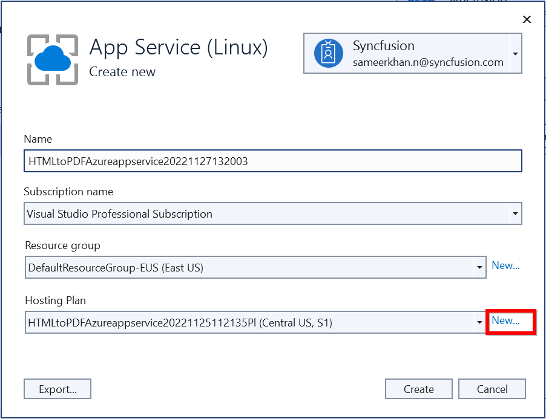

4. HTML to PDF conversion works from basic hosting plan (B1 to P3). So, select the hosting plan as required. HTML to PDF conversion will not work if the hosting plan is Free/Shared.
    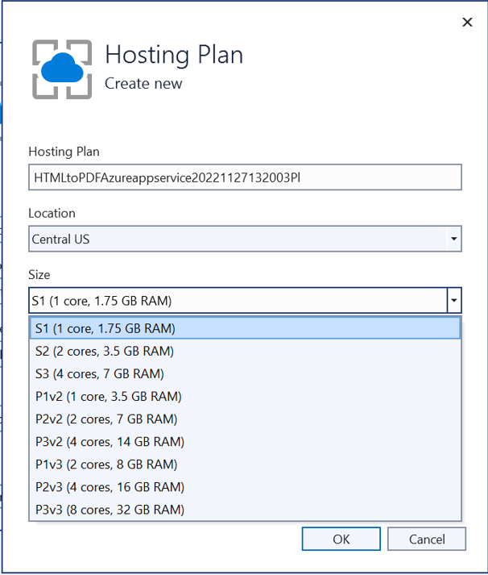

5. After creating a profile, click the publish button.
    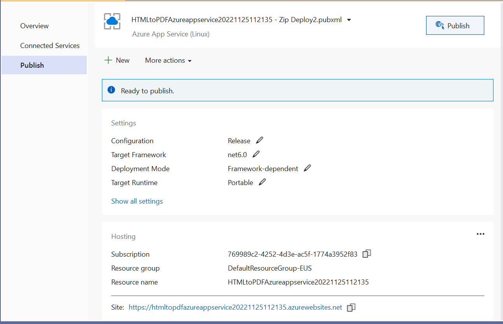

   Now, the published webpage will open in the browser. Click Export to PDF button to convert Syncfusion webpage to PDF document.
   

