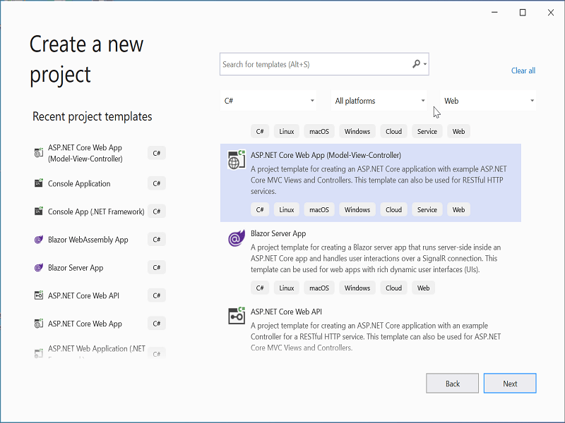
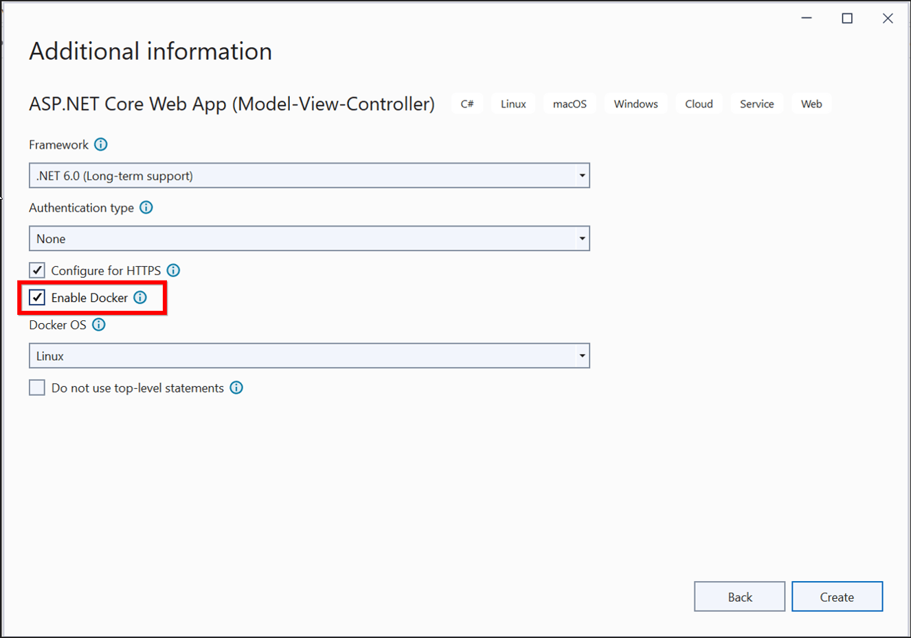
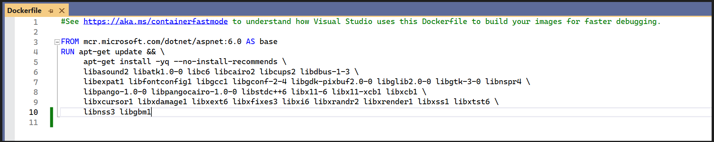
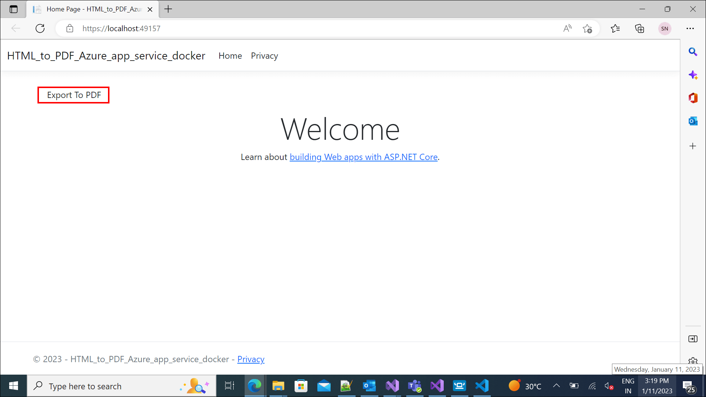
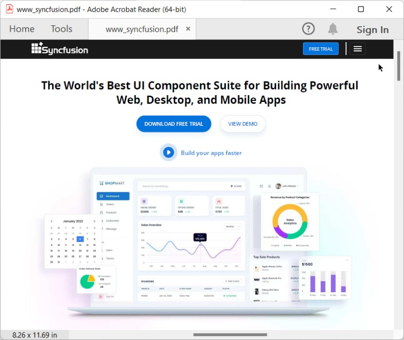
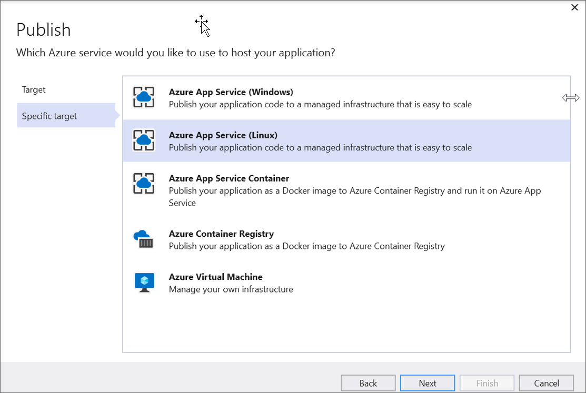
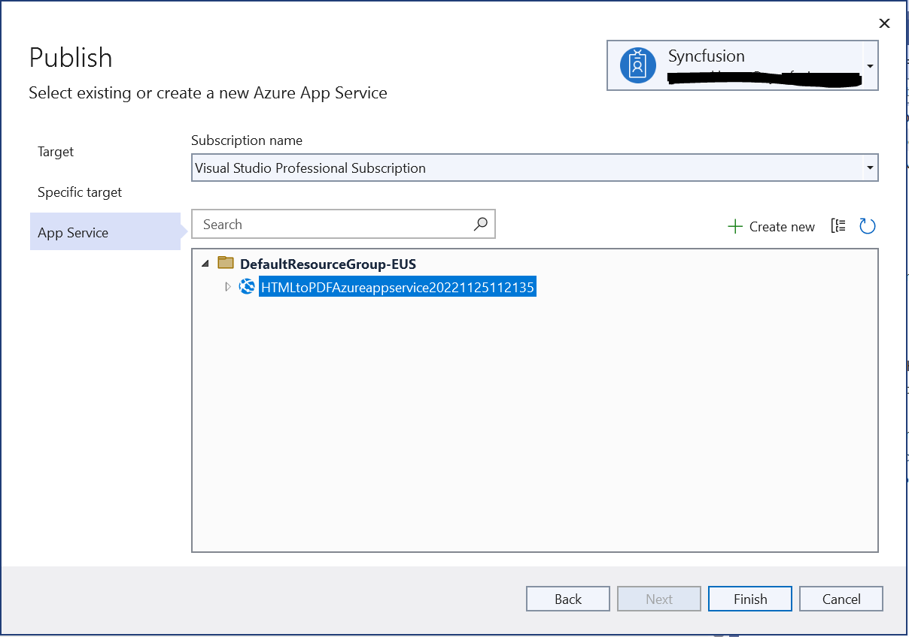
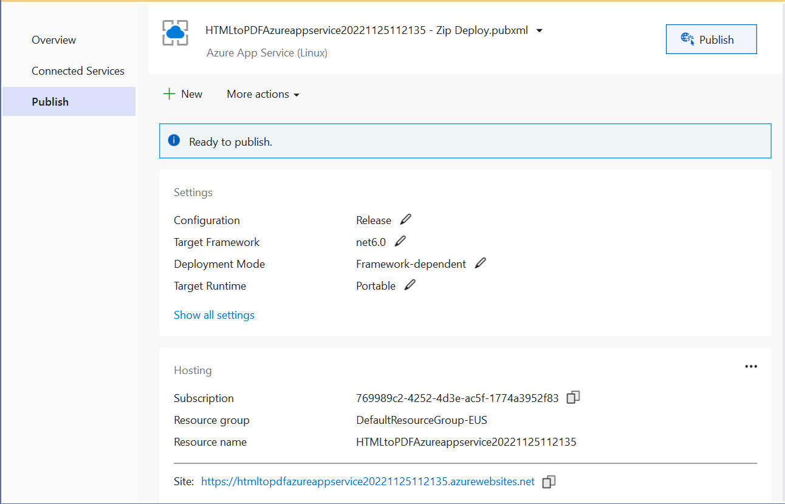
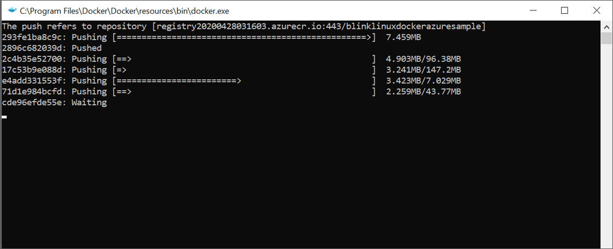

# Convert HTML to PDF file in Azure App Service Linux with docker using C#

The Syncfusion [HTML to PDF converter](https://www.syncfusion.com/document-processing/pdf-framework/net/html-to-pdf) is a .NET library for converting webpages, SVG, MHTML, and HTML to PDF using C# in Azure App Service on Linux, Azure app service using the Linux [Docker](https://www.docker.com/why-docker) container and Azure Function Application Linux.

## Steps to convert HTML to PDF in Azure app service using Blink with Linux docker container

1. Create a new ASP.NET Core Web app MVC project.
    

2. Choose your project's target framework, select Configure for HTTPS and Enable Docker.
    

3. Install the [Syncfusion.HtmlToPdfConverter.Net.Linux](https://www.nuget.org/packages/Syncfusion.HtmlToPdfConverter.Net.Linux/) NuGet packages as a reference to your .NET Core application [NuGet.org](https://www.nuget.org/).


4. Include the following commands in the [Dockerfile](HTML_to_PDF_Azure_app_service_docker/Dockerfile) to install the dependent packages in the docker container.

    ```csharp

   RUN apt-get update && \
     apt-get install -yq --no-install-recommends \ 
     libasound2 libatk1.0-0 libc6 libcairo2 libcups2 libdbus-1-3 \ 
     libexpat1 libfontconfig1 libgcc1 libgconf-2-4 libgdk-pixbuf2.0-0 libglib2.0-0 libgtk-3-0 libnspr4 \ 
     libpango-1.0-0 libpangocairo-1.0-0 libstdc++6 libx11-6 libx11-xcb1 libxcb1 \ 
     libxcursor1 libxdamage1 libxext6 libxfixes3 libxi6 libxrandr2 libxrender1 libxss1 libxtst6 \ 
     libnss3 libgbm1

   ```

    

5. Add a new button in the [Index.cshtml](HTML_to_PDF_Azure_app_service_docker/Views/Home/Index.cshtml) file.

   ```csharp

   <div class="btn">
    @{ Html.BeginForm("ExportToPDF", "Home", FormMethod.Post);
        {
            <input type="submit" value="Export To PDF" class=" btn" />
        }
     }
   </div>

   ```

    
6. Include the following namespaces in the [HomeController.cs](HTML_to_PDF_Azure_app_service_docker/Controllers\HomeController.cs) file.

   ```csharp

   using Syncfusion.HtmlConverter;
   using Syncfusion.Pdf;
   using System.IO;

   ```

7. Add a new action method ExportToPDF in [HomeController.cs](HTML_to_PDF_Azure_app_service_docker/Controllers\HomeController.cs) file and include the below code example to convert HTML to PDF file and download it.  

   ```csharp

        public ActionResult ExportToPDF()
        {
            //Initialize HTML to PDF converter. 
            HtmlToPdfConverter htmlConverter = new HtmlToPdfConverter();
            BlinkConverterSettings settings = new BlinkConverterSettings();
            //Set command line arguments to run without the sandbox.
            settings.CommandLineArguments.Add("--no-sandbox");
            settings.CommandLineArguments.Add("--disable-setuid-sandbox");
            //Assign Blink settings to the HTML converter.
            htmlConverter.ConverterSettings = settings;
            //Convert URL to PDF.
            PdfDocument document = htmlConverter.Convert("https://www.syncfusion.com");
            MemoryStream stream = new MemoryStream();
            //Save and close a PDF document. 
            document.Save(stream);
            return File(stream.ToArray(), System.Net.Mime.MediaTypeNames.Application.Pdf, "URL_to_PDF.pdf");
        }

   ```

8. Build and run the sample in docker, it will pull the Linux docker image from the docker hub and run the project. Now, the webpage will open in the browser and click the button to convert the Syncfusion webpage to a PDF.

    

   By executing the program, you will get the PDF document as follows.
    

## Deploy the container to Azure container instance

1. Create a publish target to deploy the docker image to Azure. 
    

2. Create Azure App Service with resource group, hosting plan, and container registry. 
    

3. Publish the docker image to Azure container instance.
    

4. It will push the docker image to the Azure container registry and deploy it to the Azure container instance.
    

5. After successful deployment, it will open the Azure website in the browser.
    


6. Click the button to convert Syncfusion webpage to a PDF document. You will get the PDF document as follows.
     

