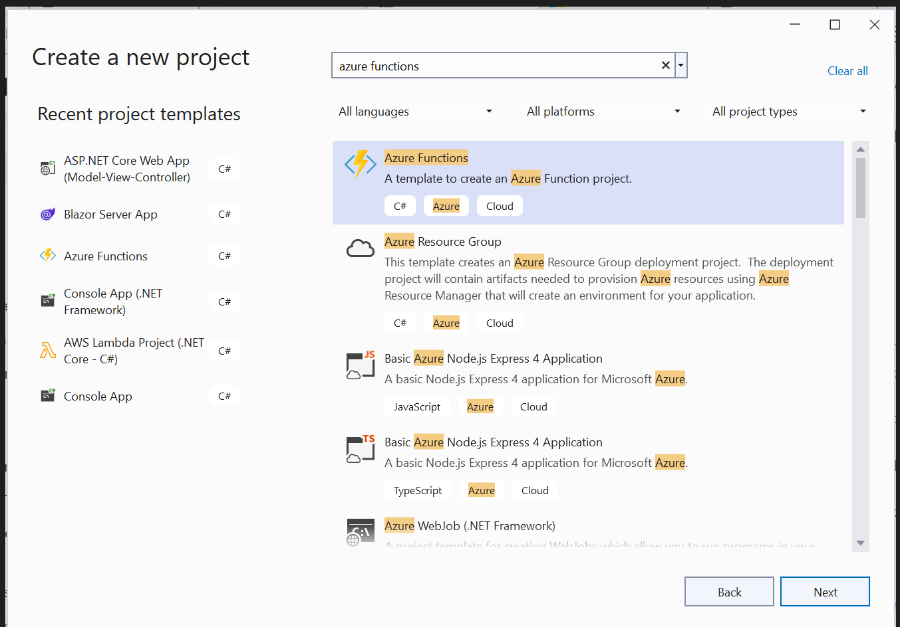
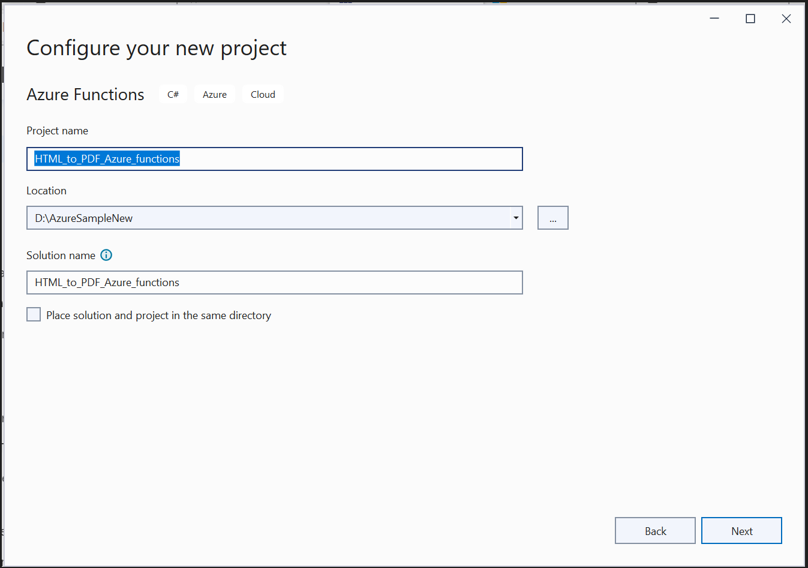
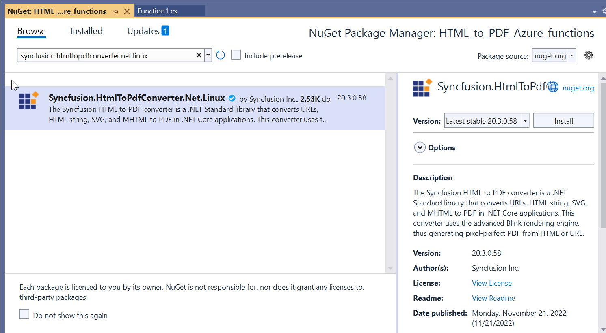
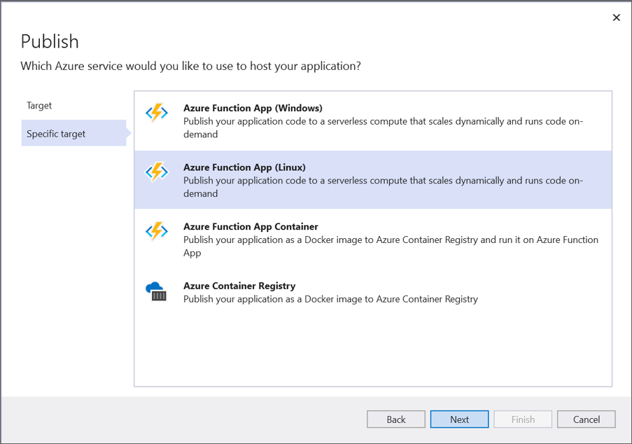
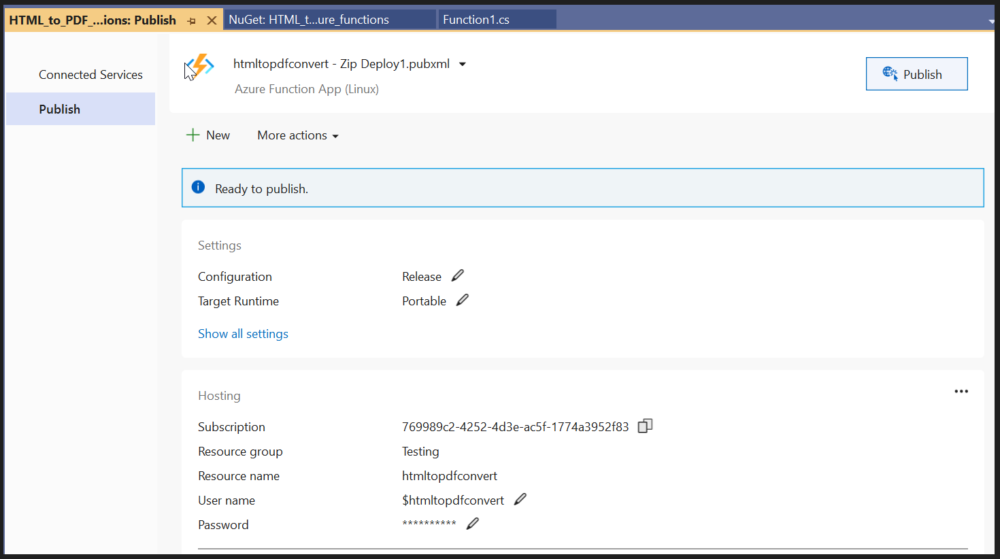

# Convert HTML to PDF file in Azure App Function Linux using C#

The Syncfusion&reg; [HTML to PDF converter](https://www.syncfusion.com/document-processing/pdf-framework/net/html-to-pdf) is a .NET library for converting webpages, SVG, MHTML, and HTML to PDF using C# in Azure App Service on Linux, Azure app service using the Linux [docker](https://www.docker.com/why-docker) container and Azure Function Application Linux.

## Steps to convert HTML to PDF in the Azure Functions using the Blink rendering engine
1. Create the Azure function project.
     

2. Select the Azure Functions type and .NET Core version.
     

3. Install the [Syncfusion.HtmlToPdfConverter.Net.Linux](https://www.nuget.org/packages/Syncfusion.HtmlToPdfConverter.Net.Linux/) NuGet package as a reference to your .NET Core application [NuGet.org](https://www.nuget.org/).
     
4. Include the following namespaces in Function1.cs file.

   ```csharp

   using Syncfusion.HtmlConverter;
   using Syncfusion.Pdf;
   using System.Runtime.InteropServices;

   ```

5. Add the following code snippet in the [Function1 class](HtmlToPdfBlinkAzureFunction/Function1.cs) file to convert HTML to PDF using Blink rendering engine in the Azure Functions Linux.

   ```csharp

        [FunctionName("Function1")]
        public static async Task<IActionResult> Run([HttpTrigger(AuthorizationLevel.Function, "get", "post", Route = null)] HttpRequest req, ILogger log, ExecutionContext executionContext)
        {
            string blinkBinariesPath = string.Empty;
            try
            {
                blinkBinariesPath = SetupBlinkBinaries(executionContext);
            }
            catch
            {
                throw new Exception("BlinkBinaries initialization failed");
            }
            string url = req.Query["url"];
            //Initialize the HTML to PDF converter with the Blink rendering engine.
            HtmlToPdfConverter htmlConverter = new HtmlToPdfConverter(HtmlRenderingEngine.Blink);
            BlinkConverterSettings settings = new BlinkConverterSettings();
            //Set command line arguments to run without sandbox.
            settings.CommandLineArguments.Add("--no-sandbox");
            settings.CommandLineArguments.Add("--disable-setuid-sandbox");
            settings.BlinkPath = blinkBinariesPath;
            //Assign WebKit settings to the HTML converter 
            htmlConverter.ConverterSettings = settings;
            //Convert URL to PDF
            PdfDocument document = htmlConverter.Convert(url);
            MemoryStream ms = new MemoryStream();
            //Save and close the PDF document  
            document.Save(ms);
            document.Close();
            ms.Position = 0;
            return new FileStreamResult(ms, "application/pdf");
        }


   ```

6. Add the following helper methods to copy and set permission to the BlinkBinariesLinux folder.

    ```csharp

        private static string SetupBlinkBinaries(ExecutionContext executionContext)
        {
            string blinkAppDir = Path.Combine(executionContext.FunctionAppDirectory, "BlinkBinariesLinux");
            string tempBlinkDir = Path.GetTempPath();
            string chromePath = Path.Combine(tempBlinkDir, "chrome");
            if (!File.Exists(chromePath))
            {
                CopyFilesRecursively(blinkAppDir, tempBlinkDir);
                SetExecutablePermission(tempBlinkDir);
            }
            return tempBlinkDir;
        }
        private static void CopyFilesRecursively(string sourcePath, string targetPath)
        {
            //Create all the directories from the source to the destination path.
            foreach (string dirPath in Directory.GetDirectories(sourcePath, "*", SearchOption.AllDirectories))
            {
                Directory.CreateDirectory(dirPath.Replace(sourcePath, targetPath));
            }
            //Copy all the files from the source path to the destination path.
            foreach (string newPath in Directory.GetFiles(sourcePath, "*.*", SearchOption.AllDirectories))
            {
                File.Copy(newPath, newPath.Replace(sourcePath, targetPath), true);
            }
        }
        [DllImport("libc", SetLastError = true, EntryPoint = "chmod")]
        internal static extern int Chmod(string path, FileAccessPermissions mode);
        private static void SetExecutablePermission(string tempBlinkDir)
        {
            FileAccessPermissions ExecutableFilePermissions = FileAccessPermissions.UserRead | FileAccessPermissions.UserWrite | FileAccessPermissions.UserExecute |
            FileAccessPermissions.GroupRead | FileAccessPermissions.GroupExecute | FileAccessPermissions.OtherRead | FileAccessPermissions.OtherExecute;
            string[] executableFiles = new string[] { "chrome", "chrome_sandbox" };
            foreach (string executable in executableFiles)
            {
                var execPath = Path.Combine(tempBlinkDir, executable);
                if (File.Exists(execPath))
                {
                    var code = Function1.Chmod(execPath, ExecutableFilePermissions);
                    if (code != 0)
                    {
                        throw new Exception("Chmod operation failed");
                    }
                }
            }

    ```

7. Include the below enum in the [Function1 class](HtmlToPdfBlinkAzureFunction/Function1.cs) file. 

    ```csharp

         [Flags]
        internal enum FileAccessPermissions : uint
        {
            OtherExecute = 1,
            OtherWrite = 2,
            OtherRead = 4,
            GroupExecute = 8,
            GroupWrite = 16,
            GroupRead = 32,
            UserExecute = 64,
            UserWrite = 128,
            UserRead = 256
        }

   ```

## Publish to Azure Functions Linux

1. Right-click the project and select Publish. Then, create a new profile in the Publish Window. The Blink rendering engine will work in consumption plan. So, you can create the Azure Function App service with a consumption plan.
     

2. After creating the profile, click the Publish button.
     

3. Now, go to the Azure portal and select the App Services. After running the service, click Get function URL > Copy. Include the URL as a query string in the URL. Then, paste it into the new browser tab. You will get the PDF document as follows.
     