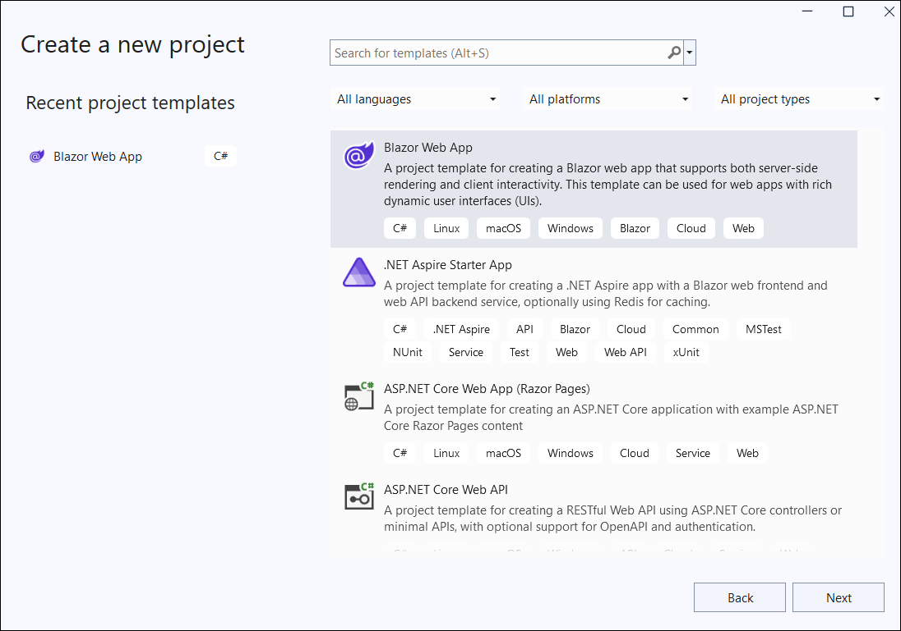
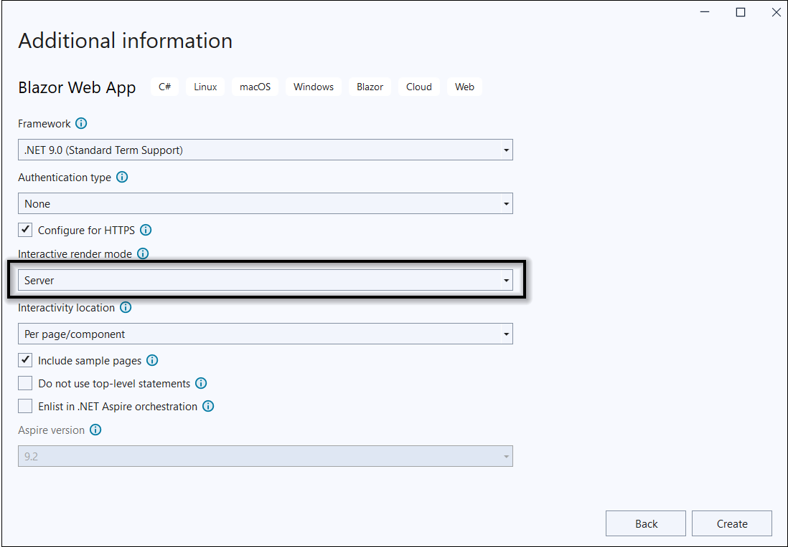
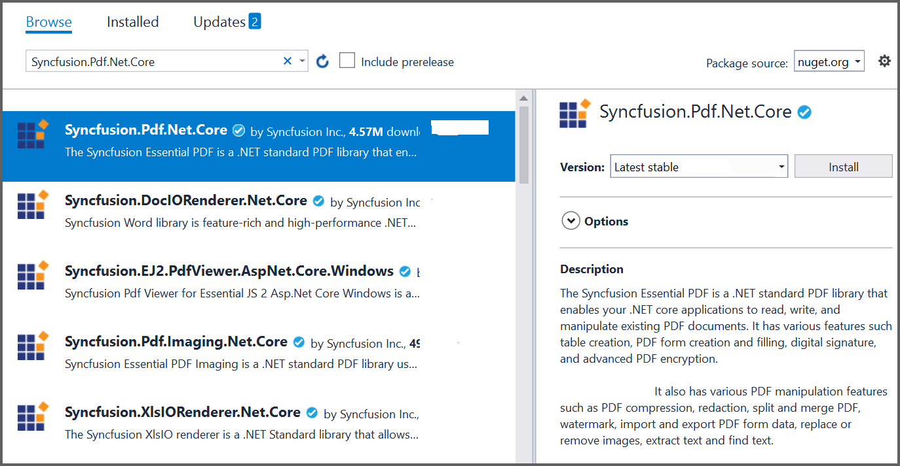
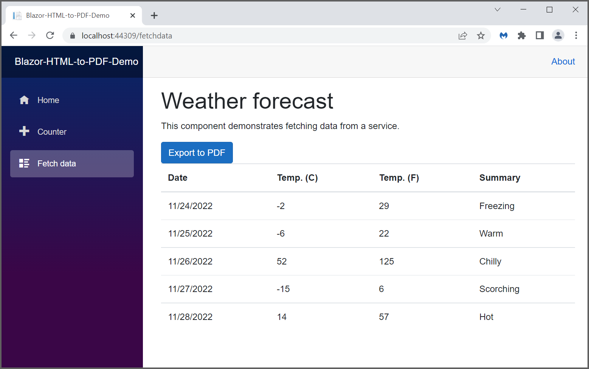
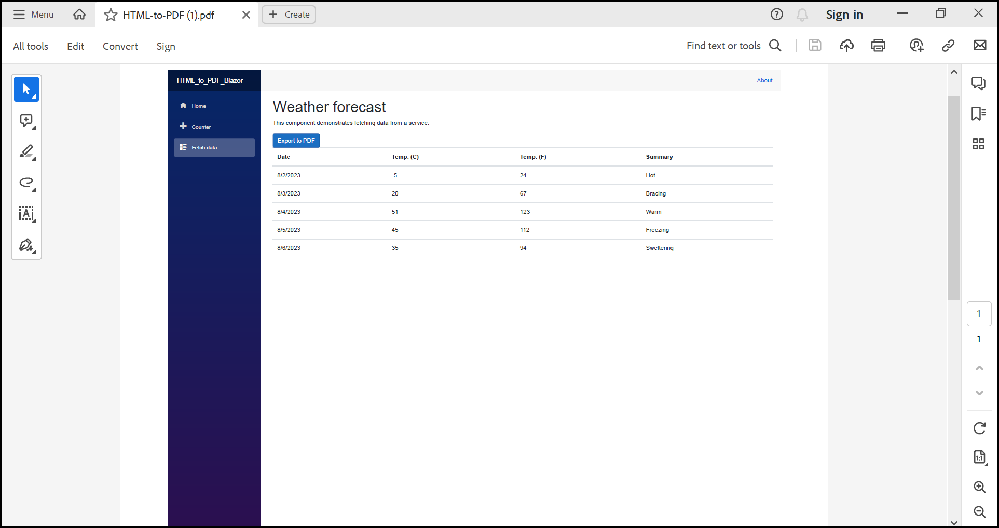

##### Example: Blazor

# Convert HTML to PDF file in Blazor using C#

The Syncfusion&reg; HTML to PDF converter is a .NET library used to convert HTML or web pages to PDF document in Blazor application.

## Steps to convert HTML to PDF in Blazor application

1. Create a new C# Blazor server-side application project. Select **Blazor Web App** from the template and click the Next button.
   

2. In the project configuration window, name your project and select Create.
   

3. To create a PDF document in a Blazor Server app, install the [Syncfusion.PDF.Net.Core](https://www.nuget.org/packages/Syncfusion.pdf.Net.Core) package into the Blazor project.
   

Step 4: Create a new cs file named **ExportService.cs** under **Data** folder and include the following namespaces in the file.

```csharp
using Syncfusion.Pdf;
using Syncfusion.Pdf.Graphics;
using Syncfusion.Pdf.Grid;
using Syncfusion.Drawing;
```

Step 5: The [PdfDocument](https://help.syncfusion.com/cr/document-processing/Syncfusion.Pdf.PdfDocument.html) object represents an entire PDF document that is being created. The [PdfTextElement](https://help.syncfusion.com/cr/document-processing/Syncfusion.Pdf.Graphics.PdfTextElement.html) adds text in a PDF document and provides the layout result of the added text by using the location of the next element that decides to prevent content overlapping. The [PdfGrid](https://help.syncfusion.com/cr/document-processing/Syncfusion.Pdf.Grid.PdfGrid.html) allows table creation by entering data manually or from external data sources. 

Add the following code sample in the `ExportService` class which illustrates how to create a simple PDF document using `PdfTextElement` and `PdfGrid`. 

```csharp
//Export weather data to PDF document.
public static MemoryStream CreatePdf(WeatherForecast[] forecasts)
{
    if (forecasts == null)
    {
        throw new ArgumentNullException("Forecast cannot be null");
    }
    //Create a new PDF document.
    using (PdfDocument pdfDocument = new PdfDocument())
    {
        int paragraphAfterSpacing = 8;
        int cellMargin = 8;
        //Add page to the PDF document.
        PdfPage page = pdfDocument.Pages.Add();
        //Create a new font.
        PdfStandardFont font = new PdfStandardFont(PdfFontFamily.TimesRoman, 16);

        //Create a text element to draw a text in PDF page.
        PdfTextElement title = new PdfTextElement("Weather Forecast", font, PdfBrushes.Black);
        PdfLayoutResult result = title.Draw(page, new PointF(0, 0));
        PdfStandardFont contentFont = new PdfStandardFont(PdfFontFamily.TimesRoman, 12);
        PdfTextElement content = new PdfTextElement("This component demonstrates fetching data from a service and Exporting the data to PDF document using Syncfusion .NET PDF library.", contentFont, PdfBrushes.Black);
        PdfLayoutFormat format = new PdfLayoutFormat();
        format.Layout = PdfLayoutType.Paginate;
        //Draw a text to the PDF document.
        result = content.Draw(page, new RectangleF(0, result.Bounds.Bottom + paragraphAfterSpacing, page.GetClientSize().Width, page.GetClientSize().Height), format);

        //Create a PdfGrid.
        PdfGrid pdfGrid = new PdfGrid();
        pdfGrid.Style.CellPadding.Left = cellMargin;
        pdfGrid.Style.CellPadding.Right = cellMargin;
        //Applying built-in style to the PDF grid.
        pdfGrid.ApplyBuiltinStyle(PdfGridBuiltinStyle.GridTable4Accent1);

        //Assign data source.
        pdfGrid.DataSource = forecasts;
        pdfGrid.Style.Font = contentFont;
        //Draw PDF grid into the PDF page.
        pdfGrid.Draw(page, new Syncfusion.Drawing.PointF(0, result.Bounds.Bottom + paragraphAfterSpacing));

        using (MemoryStream stream = new MemoryStream())
        {
            //Saving the PDF document into the stream.
            pdfDocument.Save(stream);
            //Closing the PDF document.
            pdfDocument.Close(true);
            return stream;                
        }
    }
}
```

Step 6: Register the service in the `Program.cs` class as follows.

```csharp
services.AddRazorPages();
services.AddServerSideBlazor();
services.AddSingleton<WeatherForecastService>();
services.AddSingleton<ExportService>();
```

Step 7: Inject `ExportService` into `Weather.razor` using the following code.

```csharp
@inject ExportToFileService exportService
@inject Microsoft.JSInterop.IJSRuntime JS
@using  System.IO;

```

Create a button in the `Weather.razor` using the following code.

```csharp
<button class="btn btn-primary" @onclick="@ExportToPdf">Export to PDF</button>
```

Add the `ExportToPdf` method in `Weather.razor` page to call the export service.

```csharp
@functions
{
    protected async Task ExportToPdf()
    {
        using (MemoryStream excelStream = ExportService.CreatePdf(forecasts))
        {
            await JS.SaveAs("Sample.pdf", excelStream.ToArray());
        }
    }
}
```

Step 8: Include the `FileUtil` class within the `ExportService.cs` file to enable file-related operations as part of the export functionality.

```csharp
public static class FileUtil
{
    public static ValueTask<object> SaveAs(this IJSRuntime js, string filename, byte[] data)
       => js.InvokeAsync<object>(
           "saveAsFile",
           filename,
           Convert.ToBase64String(data));
}
```

Step 9: Add the following JavaScript function in the `App.razor` available under the `Components` folder.

```csharp
<script type="text/javascript">
    function saveAsFile(filename, bytesBase64) {
            if (navigator.msSaveBlob) {
                //Download document in Edge browser
                var data = window.atob(bytesBase64);
                var bytes = new Uint8Array(data.length);
                for (var i = 0; i < data.length; i++) {
                    bytes[i] = data.charCodeAt(i);
                }
                var blob = new Blob([bytes.buffer], { type: "application/octet-stream" });
                navigator.msSaveBlob(blob, filename);
            }
            else {
        var link = document.createElement('a');
        link.download = filename;
        link.href = "data:application/octet-stream;base64," + bytesBase64;
        document.body.appendChild(link); // Needed for Firefox
        link.click();
        document.body.removeChild(link);
    }
        }
</script>

```

Step 10: Build the project.

Click on Build > Build Solution or press Ctrl + Shift + B to build the project.

Step 11: Run the project.

Click the Start button (green arrow) or press F5 to run the app.

The following output appears in the browser after executing the program.


Click the `Export to PDF` button to obtain the PDF document with the following output.

