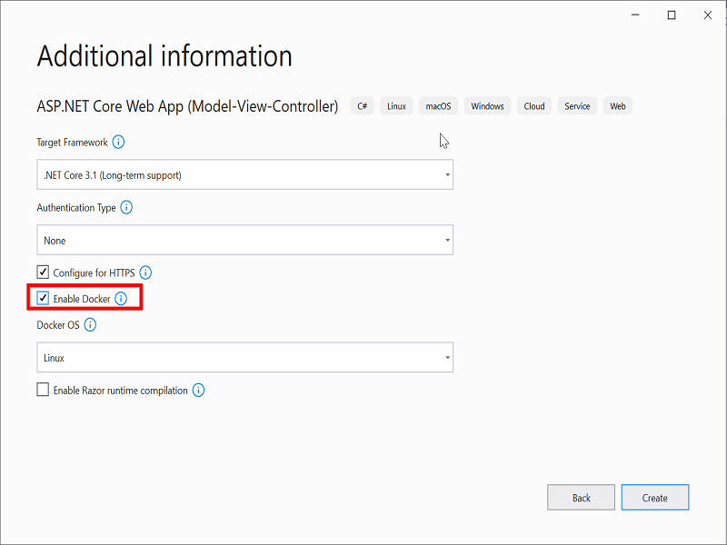
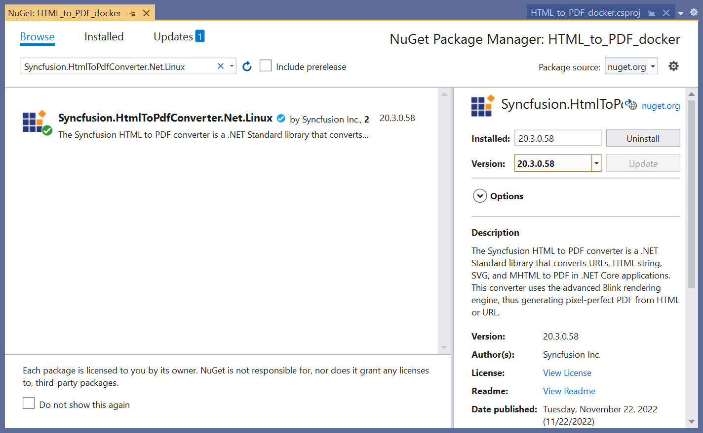
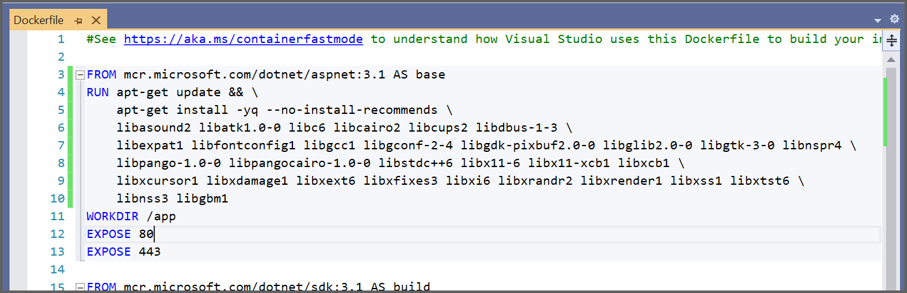

##### Example: Docker

# Convert HTML to PDF file in Linux Docker container using C#

The Syncfusion&reg; HTML to PDF converter is a .NET library that converts HTML or web pages to PDF document in a Linux [Docker](https://www.docker.com/why-docker/) container.

## Steps to convert HTML to PDF in Linux Docker container

1. Create a new ASP.NET Core application and enable the Docker support with Linux as a target OS.
   
   

2. Install the [Syncfusion.HtmlToPdfConverter.Net.Linux](https://www.nuget.org/packages/Syncfusion.HtmlToPdfConverter.Net.Linux/) NuGet package as a reference to your .NET Core application [NuGet.org](https://www.nuget.org/).
   

3. Include the following commands in the Docker file to install the dependent packages in the docker container.

   ```csharp
   RUN apt-get update && \
       apt-get install -yq --no-install-recommends \ 
       libasound2 libatk1.0-0 libc6 libcairo2 libcups2 libdbus-1-3 \ 
       libexpat1 libfontconfig1 libgcc1 libgconf-2-4 libgdk-pixbuf2.0-0 libglib2.0-0 libgtk-3-0 libnspr4 \ 
       libpango-1.0-0 libpangocairo-1.0-0 libstdc++6 libx11-6 libx11-xcb1 libxcb1 \ 
       libxcursor1 libxdamage1 libxext6 libxfixes3 libxi6 libxrandr2 libxrender1 libxss1 libxtst6 \ 
       libnss3 libgbm1
   ```
   

4. Add a new button in the [index.cshtml](HTML_to_PDF_docker/Views/Home/Index.cshtml) as shown below.

   ```csharp
   <div class="btn">
      @{ Html.BeginForm("ExportToPDF", "Home", FormMethod.Post);
         {
            <input type="submit" value="Export To PDF" class=" btn" />
         }
      }
   </div>
   ```

   

5. A default controller with name HomeController.cs gets added on creation of ASP.NET Core project. Include the following namespaces in that [HomeController.cs](HTML_to_PDF_docker/Controllers/HomeController.cs) file.

   ```csharp
   using Syncfusion.HtmlConverter;
   using Syncfusion.Pdf;
   using System.IO;
   ```

6. Add a new action method in [HomeController.cs](HTML_to_PDF_docker/Controllers/HomeController.cs) and include the below code snippet to convert HTML to PDF document.

   ```csharp
   public ActionResult ExportToPDF()
   {
      //Initialize HTML to PDF converter. 
      HtmlToPdfConverter htmlConverter = new HtmlToPdfConverter(); 
      BlinkConverterSettings settings = new BlinkConverterSettings();     
      //Set command line arguments to run without the sandbox.
      settings.CommandLineArguments.Add("--no-sandbox");
      settings.CommandLineArguments.Add("--disable-setuid-sandbox");     
      //Set Blink viewport size.
      settings.ViewPortSize = new Syncfusion.Drawing.Size(1280, 0);     
      //Assign Blink settings to the HTML converter.
      htmlConverter.ConverterSettings = settings; 
      //Convert URL to PDF document.
      PdfDocument document = htmlConverter.Convert("https://www.syncfusion.com"); 
      //Create memory stream.
      MemoryStream stream = new MemoryStream(); 
      //Save the document to memory stream. 
      document.Save(stream); 
      return File(stream.ToArray(), System.Net.Mime.MediaTypeNames.Application.Pdf, "HTML-to-PDF.pdf");
   }
   ```

6. Build and run the sample in the Docker. It will pull the Linux Docker image from the Docker hub and run the project. Now, the webpage will open in the browser. Click the button to convert the webpage to a PDF.

   By executing the program, you will get the PDF document as follows.
   
 