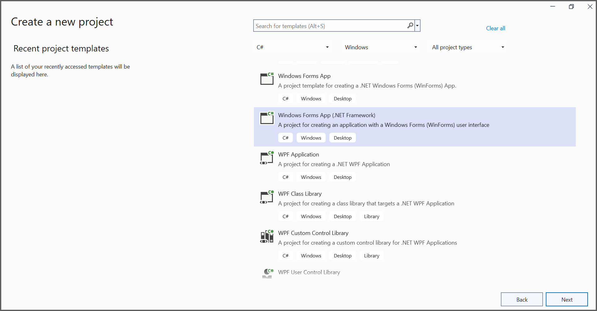
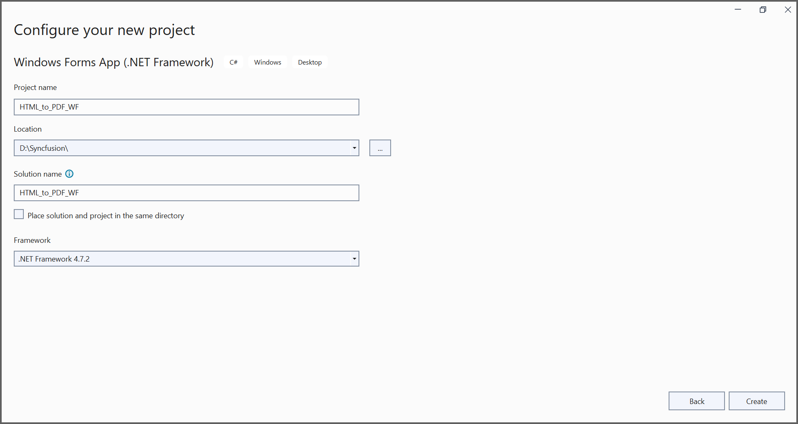
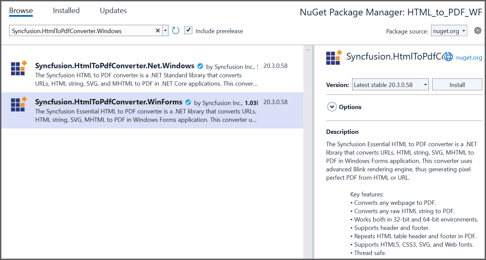

##### Example: Windows Forms

# Convert HTML to PDF file in Windows Forms using C#

The Syncfusion HTML to PDF converter is a .NET library used to convert HTML or web pages to PDF document in Windows Forms application.

## Steps to convert Html to PDF document in Windows Forms

1. Create a new Windows Forms application project.
   
   In project configuration window, name your project and select Create.
   

2. Install the [Syncfusion.HtmlToPdfConverter.WinForms](https://www.nuget.org/packages/Syncfusion.HtmlToPdfConverter.WinForms) NuGet package as a reference to your WinForms application [NuGet.org](https://www.nuget.org/).
   

3. Add the following namespaces into [Form1.Designer.cs](HTML_to_PDF_WF/Form1.Designer.cs) file.

   ```csharp
   using System.Windows.Forms;
   ```

4. Add a new button in [Form1.Designer.cs](HTML_to_PDF_WF/Form1.Designer.cs) to convert HTML to PDF document as follows.

   ```csharp
   private Button button1;

   private void InitializeComponent()
   {
      this.button1 = new System.Windows.Forms.Button();
      this.SuspendLayout();
      // 
      // button1
      // 
      this.button1.Location = new System.Drawing.Point(265, 147);
      this.button1.Name = "button1";
      this.button1.Size = new System.Drawing.Size(200, 81);
      this.button1.TabIndex = 0;
      this.button1.Text = "Convert HTML to PDF";
      this.button1.UseVisualStyleBackColor = true;
      this.button1.Click += new System.EventHandler(this.button1_Click);
      // 
      // Form1
      // 
      this.AutoScaleDimensions = new System.Drawing.SizeF(9F, 20F);
      this.AutoScaleMode = System.Windows.Forms.AutoScaleMode.Font;
      this.ClientSize = new System.Drawing.Size(800, 450);
      this.Controls.Add(this.button1);
      this.Name = "Form1";
      this.Text = "Form1";
      this.ResumeLayout(false);

      }
   ```

5. Include the following namespaces in the [Form1.cs](HTML_to_PDF_WF/Form1.cs) file.

   ```csharp
   using Syncfusion.HtmlConverter;
   using Syncfusion.Pdf;
   using System;
   ```

6. Create the [btnCreate_Click](HTML_to_PDF_WF/Form1.cs) event and add the following code in btnCreate_Click to convert HTML to PDF document.

   ```csharp
   //Initialize HTML to PDF converter
   HtmlToPdfConverter htmlConverter = new HtmlToPdfConverter();
   BlinkConverterSettings blinkConverterSettings = new BlinkConverterSettings();
   //Set Blink viewport size
   blinkConverterSettings.ViewPortSize = new System.Drawing.Size(1280, 0);
   //Assign Blink converter settings to HTML converter
   htmlConverter.ConverterSettings = blinkConverterSettings;
   //Convert URL to PDF document
   PdfDocument document = htmlConverter.Convert("https://www.syncfusion.com");
   //Create file stream
   FileStream stream = new FileStream("HTML-to-PDF.pdf", FileMode.CreateNew);
   //Save the document into stream
   document.Save(stream);
   //If the position is not set to '0' then the PDF will be empty
   stream.Position = 0;
   //Close the document
   document.Close();
   stream.Dispose();
   ```

   By executing the program, you will get the PDF document as follows.
   
